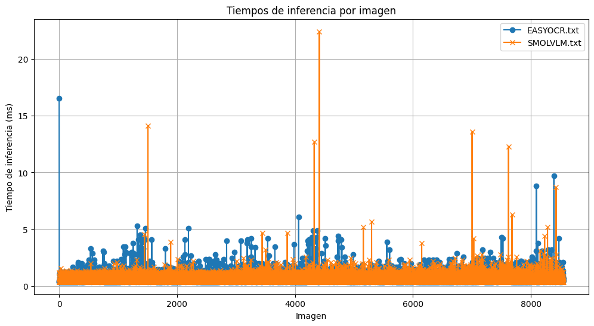
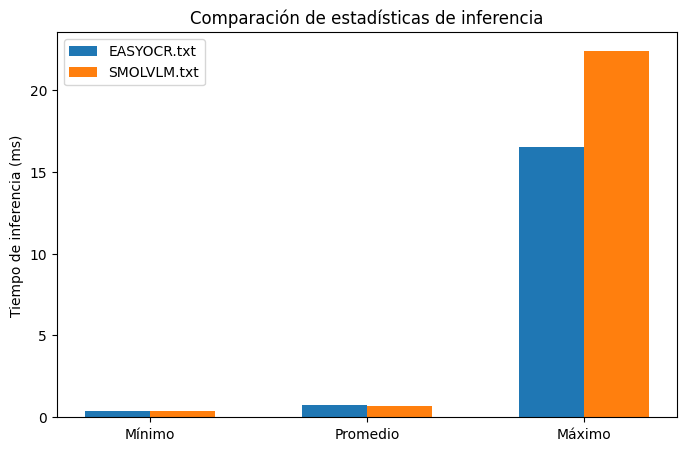

# Detección de Vehículos y Lectura de Matrículas con YOLO y OCR

Este proyecto realiza la **detección de vehículos y personas en vídeo** usando modelos YOLO y el reconocimiento de **matrículas** mediante OCR. Se implementan dos enfoques de OCR: **EasyOCR** y **SmolVLM**, permitiendo comparar velocidad y precisión.

---

## Requisitos

- Python >= 3.9
- CUDA compatible si se desea usar GPU
- Librerías principales:
  ```bash
  pip install torch torchvision torchaudio
  pip install ultralytics opencv-python pandas easyocr transformers pillow matplotlib
    ```

Modelos YOLO:

`yolo11n.pt` → Modelo preentrenado para detección de personas y vehículos.

`runs/detect/train/weights/best.pt` → Modelo entrenado para detección de matrículas.

## Preparación

Comprobar GPU y CUDA:

import torch
print(torch.__version__)
print(torch.cuda.is_available())
print(torch.cuda.device_count())
if torch.cuda.is_available():
    print(torch.cuda.get_device_name(0))


### Entrenamiento del modelo de matrículas (opcional si ya tienes best.pt):

from ultralytics import YOLO
```python
model = YOLO('yolo11n.pt')
model.train(
    data='dataset/data.yaml',
    epochs=50,
    imgsz=640,
    batch=16,
    device=0
)
```

## Uso
1. Detección con YOLO y EasyOCR

- Detecta **personas** y **vehículos** en el vídeo.
- Recorta la zona de la **matrícula** detectada.
- Aplica **OCR** con **EasyOCR** para leer el texto.

### Salida generada:
- **Vídeo anotado**: `output_tracking_easyocr.mp4`
- **CSV de detecciones**: `detecciones_tracking_easyocr.csv`
- **Ouput consola**: EASYOCR.txt

## Configuración de modelos y OCR
```python
# Configuración de los modelos YOLO
model_general = YOLO('yolo11n.pt')  # Detección general (personas, vehículos)
model_plates = YOLO(r'runs\detect\train\weights\best.pt')  # Detección de matrículas
reader = easyocr.Reader(['es'], gpu=True)
```
2. Detección con YOLO y SmolVLM


- Detecta **personas** y **vehículos** en el vídeo.
- Recorta la zona de la **matrícula** detectada.
- Aplica **OCR** con **EasyOCR** para leer el texto.

### Salida generada:
- **Vídeo anotado**: `output_tracking_smolvlm.mp4`
- **CSV de detecciones**: `detecciones_tracking_smolvlm.csv`
- **Ouput consola**: SMOLVLM.txt

## Configuración de modelos y SmolVLM
```python
from transformers import AutoProcessor, AutoModelForImageTextToText
# Configuración de los modelos YOLO
model_general = YOLO('yolo11n.pt')  # Detección general (personas, vehículos)
model_plates = YOLO(r'runs\detect\train\weights\best.pt')  # Detección de matrículas
processor = AutoProcessor.from_pretrained("HuggingFaceTB/SmolVLM-Instruct")
model = AutoModelForImageTextToText.from_pretrained("HuggingFaceTB/SmolVLM-Instruct").to(Device)
```

## Funcionalidades

- Detección de objetos: personas, bicicletas, coches, motos, autobuses y camiones.

- OCR de matrículas: dos enfoques para comparar precisión y velocidad.

- CSV de resultados: información detallada por frame, incluyendo coordenadas de caja y texto detectado.

- Visualización de resultados: vídeos anotados con bounding boxes y texto de matrícula.

- Comparativa de rendimiento: genera gráficas de tiempos de inferencia por imagen y estadísticas (mínimo, promedio, máximo).

## Estructura de CSV
| frame | tipo_objeto | confianza | id_tracking | x1   | y1  | x2   | y2  | mx1    | my1  | mx2    | my2  | confianza_matricula | texto_matricula |
|-------|-------------|-----------|-------------|------|-----|------|-----|--------|------|--------|------|---------------------|-----------------|
| 1697  | car         | 0.9      | 88          | 1257 | 283 | 1516 | 508 | 1393.0 | 448.0| 1461.0 | 466.0| 0.84                | 3685KWM          |

## Comparativa de OCR

Se pueden analizar tiempos de inferencia y precisión entre EasyOCR y SmolVLM usando los logs:

EASYOCR.txt

SMOLVLM.txt

Gráficas generadas con Matplotlib:





Comparación estadística de tiempo por imagen(mínimo, promedio, máximo)

EASYOCR: promedio=0.93ms, min=0.40ms, max=17.80ms
SMOLVLM: promedio=0.66ms, min=0.40ms, max=22.40ms

## Notas

Ajusta los parámetros conf, iou, imgsz según tus necesidades y hardware.

Para vídeos largos, considera procesar por partes para evitar problemas de memoria.

SmolVLM requiere GPU y soporte para bfloat16 si se busca velocidad máxima.

## Autor

Proyecto desarrollado por Miguel Castellano Hernández

